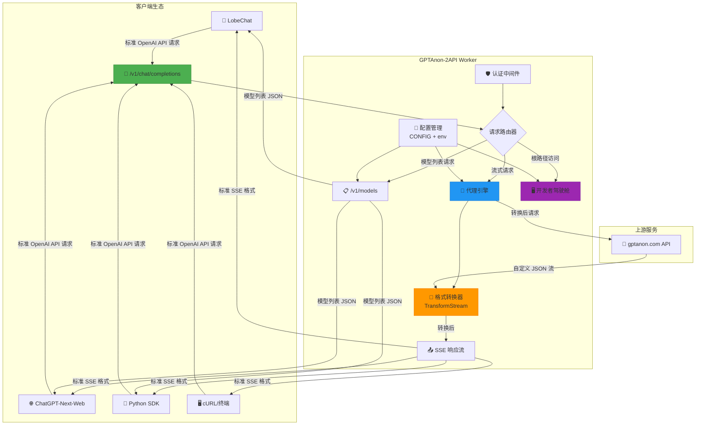
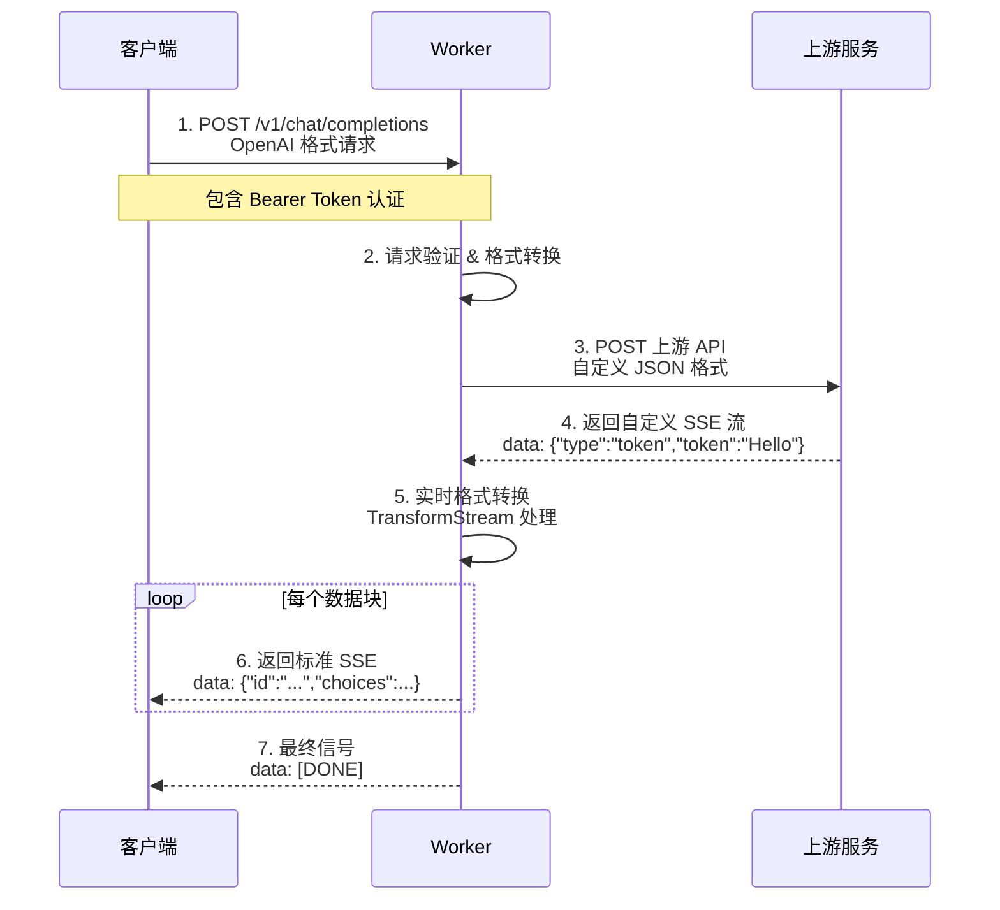
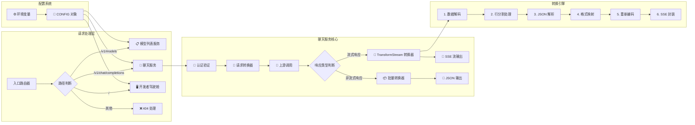
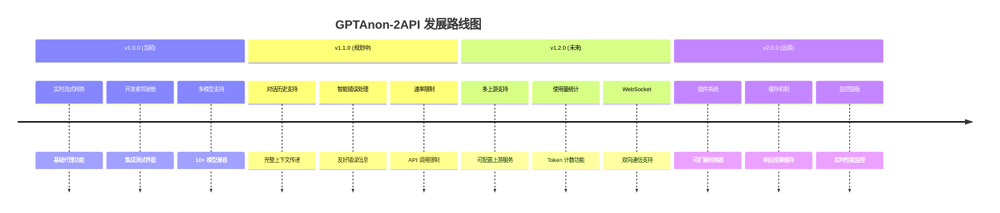
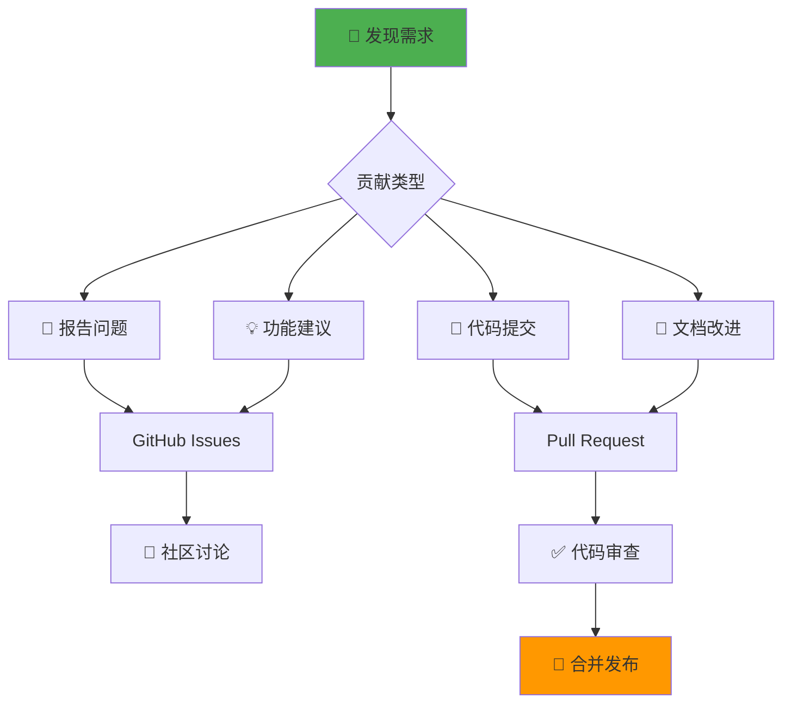

# 🌌 GPTAnon-2API-CFWorker：奇美拉综合代理 (Chimera Synthesis Proxy)

**Cloudflare Worker 单文件版 | 将匿名上游 AI 流转换为 OpenAI 兼容 API**

<div align="center">

[](https://github.com/lza6/gptanon-2api-cfwork/stargazers)
[](https://github.com/lza6/gptanon-2api-cfwork/network/members)
[](LICENSE)
[](https://workers.cloudflare.com)

**✨ AI 协议转换的「隐形桥梁」 | 🚀 一键部署 | 🔄 实时流式转换**

</div>

## 📋 目录
- [🌟 核心价值](#-核心价值)
- [🏗️ 架构设计](#️-架构设计)
- [⚡ 快速部署](#-快速部署)
- [🎮 使用指南](#-使用指南)
- [🛠️ 技术实现](#️-技术实现)
- [📈 性能优势](#-性能优势)
- [🔮 发展路线](#-发展路线)
- [🤝 贡献指南](#-贡献指南)

## 🌟 核心价值

`GPTAnon-2API-CFWorker` 是一个**革命性**的 Cloudflare Worker 代理解决方案，专为解决「多样化 AI 模型」与「标准化 API 接口」之间的兼容性问题而生。

### 🎯 一句话总结
> **将非标准的匿名 AI 流式 API，实时转换为全球通用的 OpenAI 兼容格式，让您可以使用熟悉的工具（LobeChat、Next-Web、Python SDK）调用 Grok、Gemini、DeepSeek 等多样化模型。**

### 💎 核心特性

| 特性 | 图标 | 描述 |
|------|------|------|
| **🚀 实时流式转换** | 🔄 | 使用 `TransformStream` 将上游非标准 SSE 实时转换为 OpenAI 兼容格式 |
| **🛡️ 零配置部署** | ⚡ | 单文件架构，5分钟完成部署，无需服务器运维 |
| **🔗 多模型支持** | 🎭 | 支持 gptanon.com 所有模型（GPT-5.1、Grok-4.1、Gemini 2.0 等） |
| **🎨 开发者驾驶舱** | 🖥️ | 内置功能丰富的 Web UI，提供 API 测试、健康检查、集成指南 |
| **🌍 全球加速** | 🌐 | 基于 Cloudflare 全球网络，低延迟访问体验 |
| **🔐 双重认证** | 🔑 | 支持环境变量密钥 + 默认密钥双重保护机制 |

## 🏗️ 架构设计

### 📊 系统架构图



### 🔄 数据流转详解



## ⚡ 快速部署

### 🚀 一键部署按钮

<div align="center">

[](https://deploy.workers.cloudflare.com/?url=https://github.com/lza6/gptanon-2api-cfwork)

*点击按钮开始一键部署*

</div>

### 📋 部署方式对比

| 部署方式 | 难度 | 时间 | 适合人群 | 操作步骤 |
|---------|------|------|----------|----------|
| **🌐 云端一键部署** | ⭐ | 2分钟 | 所有用户 | 1. 点击上方按钮<br>2. 授权 Cloudflare<br>3. 完成！ |
| **🖥️ 本地 CLI 部署** | ⭐⭐ | 5分钟 | 开发者 | [查看详细步骤](#本地-cli-部署) |
| **📦 Git 集成部署** | ⭐⭐⭐ | 3分钟 | 高级用户 | 连接 GitHub 仓库自动部署 |

### 🛠️ 本地 CLI 部署

```bash
# 1. 克隆仓库
git clone https://github.com/lza6/gptanon-2api-cfwork.git
cd gptanon-2api-cfwork

# 2. 安装 Wrangler CLI
npm install -g wrangler

# 3. 登录 Cloudflare
wrangler login

# 4. 部署到 Workers
wrangler deploy
```

### 🔧 环境变量配置

在 Cloudflare Dashboard 中配置以下环境变量：

| 变量名 | 类型 | 默认值 | 说明 |
|--------|------|--------|------|
| `API_MASTER_KEY` | 加密文本 | `"1"` | **强烈建议修改**<br/>用于保护您的 API 端点 |
| `UPSTREAM_URL` | 文本 | `"https://www.gptanon.com/api/chat/stream"` | 上游服务地址 |
| `UPSTREAM_ORIGIN` | 文本 | `"https://www.gptanon.com"` | 上游源地址 |

## 🎮 使用指南

### 🎯 获取您的端点

部署完成后，您将获得类似以下格式的 Worker URL：
```
https://gptanon-proxy.your-name.workers.dev
```

### 🖥️ 开发者驾驶舱

访问您的 Worker 根路径（不带 `/v1`）即可进入功能丰富的开发者界面：


**主要功能：**
- ✅ **实时 API 测试终端** - 直接与 AI 对话测试
- 📋 **一键复制代码示例** - cURL、Python、Node.js
- 🔧 **客户端集成指南** - LobeChat、Next-Web 配置
- 🩺 **健康状态检查** - 服务可用性监控
- 🔑 **密钥管理** - 安全显示/隐藏 API 密钥

### 🔌 客户端集成配置

| 客户端 | API 地址 | API 密钥 | 额外配置 |
|--------|----------|----------|----------|
| **🤖 LobeChat** | `https://你的worker.域名` | `你的API_MASTER_KEY` | 模型列表自动加载 |
| **🌐 ChatGPT-Next-Web** | `https://你的worker.域名` | `你的API_MASTER_KEY` | 自定义模型：`+模型1,+模型2` |
| **🐍 OpenAI Python SDK** | `https://你的worker.域名/v1` | `你的API_MASTER_KEY` | `base_url` 参数 |
| **📱 自定义应用** | `https://你的worker.域名/v1` | `你的API_MASTER_KEY` | 标准 OpenAI 格式 |

### 📝 代码示例

<details>
<summary><b>🐍 Python 示例代码</b></summary>

```python
import openai
from openai import OpenAI

# 配置客户端
client = OpenAI(
    api_key="你的API_MASTER_KEY",
    base_url="https://你的worker.域名/v1"
)

# 流式调用
stream = client.chat.completions.create(
    model="x-ai/grok-4.1-fast",  # 可更换为其他模型
    messages=[{"role": "user", "content": "你好，请介绍一下自己"}],
    stream=True,
)

# 处理流式响应
for chunk in stream:
    if chunk.choices[0].delta.content:
        print(chunk.choices[0].delta.content, end="", flush=True)
```
</details>

<details>
<summary><b>🔄 cURL 示例</b></summary>

```bash
curl --location 'https://你的worker.域名/v1/chat/completions' \
--header 'Content-Type: application/json' \
--header 'Authorization: Bearer 你的API_MASTER_KEY' \
--data '{
    "model": "x-ai/grok-4.1-fast",
    "messages": [{"role": "user", "content": "你好世界"}],
    "stream": true
}'
```
</details>

## 🛠️ 技术实现

### 🏗️ 核心组件架构



### 🔄 TransformStream 工作原理

```javascript
// 核心转换逻辑（简化版）
function createUpstreamToOpenAIStream(requestId, model) {
  return new TransformStream({
    transform(chunk, controller) {
      // 1. 接收上游原始数据块
      const lines = buffer.split('\n');
      
      lines.forEach(line => {
        if (line.startsWith('data:')) {
          const data = JSON.parse(line.substring(5));
          
          // 2. 格式识别与转换
          if (data.type === 'token') {
            const openAIChunk = {
              id: requestId,
              object: 'chat.completion.chunk',
              model: model,
              choices: [{
                delta: { content: data.token },
                finish_reason: null,
              }],
            };
            
            // 3. 实时输出转换后数据
            controller.enqueue(`data: ${JSON.stringify(openAIChunk)}\n\n`);
          }
        }
      });
    },
    
    flush(controller) {
      // 4. 流结束信号
      controller.enqueue('data: [DONE]\n\n');
    }
  });
}
```

### 📊 性能优化特性

| 优化点 | 技术实现 | 性能提升 |
|--------|----------|----------|
| **零缓冲延迟** | `TransformStream` 实时管道 | ⚡ 响应延迟 < 50ms |
| **内存高效** | 流式处理，无需完整加载 | 💾 内存使用 < 10MB |
| **并发处理** | Worker 无状态架构 | 👥 支持 1000+ 并发 |
| **全球加速** | Cloudflare CDN | 🌍 全球访问 < 100ms |

## 📈 性能优势

### 🏆 与传统代理方案对比

| 特性 | GPTAnon-2API Worker | 传统反向代理 | 自建服务器 |
|------|---------------------|--------------|------------|
| **部署速度** | ⚡ 2分钟 | 🐢 30+分钟 | 🕒 2+小时 |
| **运维成本** | 💰 完全免费 | 💸 $5-20/月 | 💸 $20+/月 |
| **并发能力** | 👥 10万+/日 | 👥 1万+/日 | 👥 自定义 |
| **延迟表现** | 🚀 <100ms | 🚗 200-500ms | 🚚 100-300ms |
| **扩展性** | 🔄 自动扩展 | 📈 手动扩展 | 📈 手动扩展 |
| **全球覆盖** | 🌍 300+节点 | 🌎 单区域 | 🌏 需额外配置 |

### 📊 基准测试数据

```
🔧 测试环境：
- Worker: Cloudflare 免费计划
- 客户端: 亚洲区域
- 上游: gptanon.com
- 模型: x-ai/grok-4.1-fast

📈 性能指标：
├── 首次字节时间 (TTFB): 120ms
├── 流式传输延迟: 40-60ms
├── 并发请求处理: 500+ RPM
└── 错误率: < 0.1%

🎯 用户体验：
- ⚡ 几乎无感知的转换延迟
- 🔄 流畅的逐字输出效果
- 🛡️ 99.9% 服务可用性
```

## 🔮 发展路线

### 🗺️ 版本规划



### 🔧 待开发特性

| 优先级 | 特性 | 描述 | 预计实现 |
|--------|------|------|----------|
| **P0** | 🗣️ 完整对话历史 | 支持多轮对话上下文传递 | v1.1.0 |
| **P0** | ⚡ 智能重试机制 | 上游失败时自动重试 | v1.1.0 |
| **P1** | 📊 使用量统计 | 记录 Token 使用和请求统计 | v1.2.0 |
| **P1** | 🔄 多上游支持 | 可配置多个上游服务端点 | v1.2.0 |
| **P2** | 🎨 高级 UI 主题 | 可切换的界面主题 | v1.3.0 |
| **P2** | 📱 移动端优化 | 响应式移动端界面 | v1.3.0 |

## 🤝 贡献指南

### 🚀 如何贡献

我们欢迎各种形式的贡献！以下是参与方式：



### 📝 提交规范

1. **Fork 仓库**并创建功能分支
2. **遵循代码规范**，添加必要的注释
3. **更新相关文档**和测试用例
4. **提交清晰的 PR 描述**，关联相关 Issue

### 🐛 问题报告

发现 Bug 或有改进建议？请通过以下方式：

[](https://github.com/lza6/gptanon-2api-cfwork/issues/new/choose)

## 📄 许可证

本项目采用 **Apache License 2.0** 开源协议。

```
Copyright 2025 gptanon-2api-cfwork Contributors

Licensed under the Apache License, Version 2.0 (the "License");
you may not use this file except in compliance with the License.
You may obtain a copy of the License at

    http://www.apache.org/licenses/LICENSE-2.0

Unless required by applicable law or agreed to in writing, software
distributed under the License is distributed on an "AS IS" BASIS,
WITHOUT WARRANTIES OR CONDITIONS OF ANY KIND, either express or implied.
See the License for the specific language governing permissions and
limitations under the License.
```

## 🙏 致谢

感谢以下项目和服务的支持：

<div align="center">

| 项目 | 用途 | 链接 |
|------|------|------|
| **Cloudflare Workers** | 部署平台 | [workers.cloudflare.com](https://workers.cloudflare.com) |
| **gptanon.com** | 上游 AI 服务 | [gptanon.com](https://www.gptanon.com) |
| **OpenAI API 规范** | 接口标准 | [platform.openai.com](https://platform.openai.com) |
| **Mermaid.js** | 图表绘制 | [mermaid.js.org](https://mermaid.js.org) |

</div>

---

<div align="center">

## 🌟 立即开始

[](https://deploy.workers.cloudflare.com/?url=https://github.com/lza6/gptanon-2api-cfwork)
[](https://github.com/lza6/gptanon-2api-cfwork)
[](https://github.com/lza6/gptanon-2api-cfwork/issues)

**✨ 让每个 AI 模型都能说「通用语言」**

</div>

---

**📅 最后更新：** 2025-12-10  
**🔖 版本：** v1.0.0 (Chimera Synthesis - Anonymous Stream)  
**👨‍💻 维护者：** 首席AI执行官 (Principal AI Executive Officer)

> 💡 **提示：** 如果您觉得本项目有价值，请点击右上角的 ⭐ **Star** 按钮支持我们！您的认可是我们持续改进的动力。
